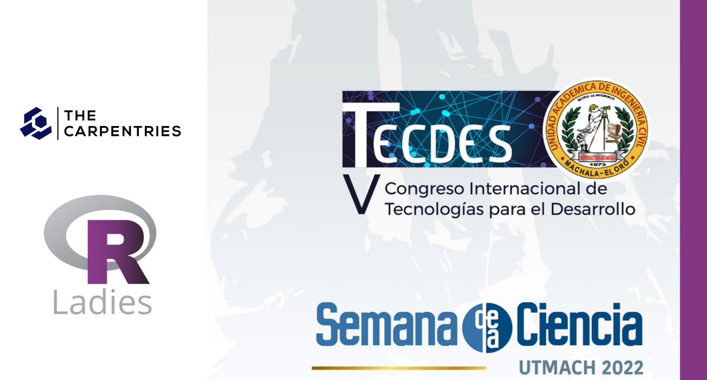
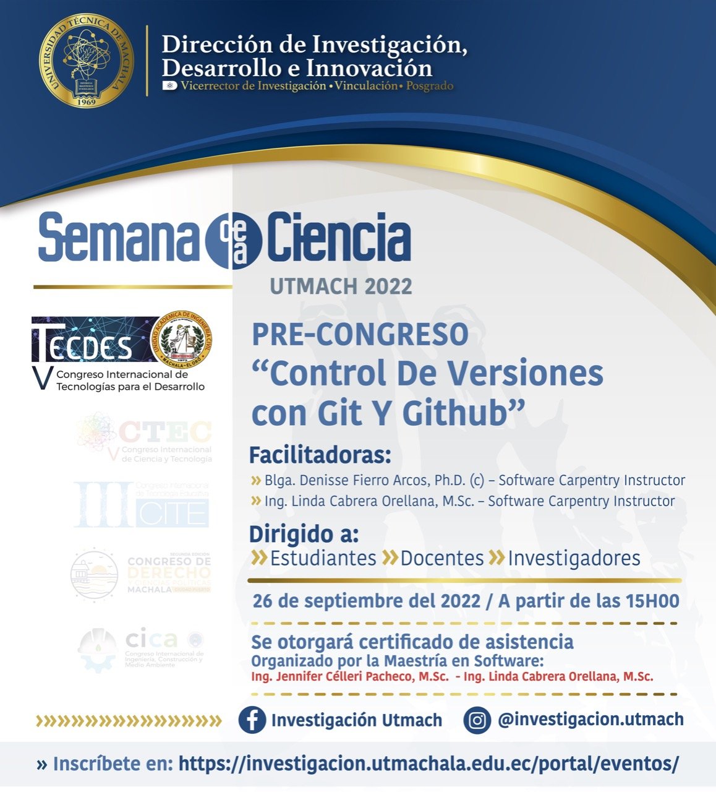

# TALLER Control de Versiones con GIT

Material del Taller "Control de Versiones con Git" en el Pre-Congreso de Tecnologías para el Desarrollo de la Semana de la Ciencia de la Universidad Técnica de Machala.

*Slides usando el paquete [xaringan](https://github.com/yihui/xaringan#xaringan) inspirado en el Tema de [RLadies-xalapa](https://spcanelon.github.io/xaringan-rladies-xalapa/index.html)* 

## Temas abordados

* Control Automatizado de Versiones
* Configurando Git
* Creando un repositorio
* Rastreando Cambios
* Explorando el "History"
* Ignorando cosas
* Repositorios remotos en GitHub
* Trabajos en colaboración
* Conflictos
* La ciencia abierta
* Licencia
* Ejemplo de Referencia o cita
* Hospedaje

## Página del evento: [Taller Control de versiones con Git y GitHub](https://investigacion.utmachala.edu.ec/portal/evento/taller-control-de-versiones-con-git-y-github/)

## Página del Taller: [Taller Control de versiones con Git](https://lidefi87.github.io/2022-09-26-UTMach_enlinea/#setup)

## Taller: [Control de versiones con Git en vivo](https://www.facebook.com/msoftwareUTMACH/videos/822805705747978)

## Lecciones: [The Carpentries: Control de versiones con Git](https://swcarpentry.github.io/git-novice-es/)
