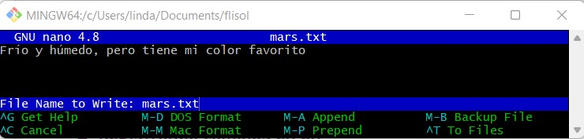
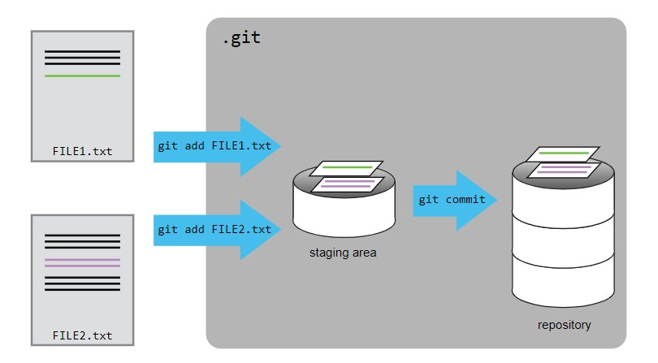

```{r configuracion, include = FALSE}
library(knitr)
library(tidyverse)
library(datos)
library(fontawesome)
# library(emo)
library(xaringanExtra)
# set default options
opts_chunk$set(echo=FALSE,
               warning=FALSE,
               collapse = TRUE,
               dpi = 300)
knit_engines$set("yaml", "markdown")

xaringanExtra::use_tile_view()
xaringanExtra::use_clipboard()
xaringanExtra::use_share_again()
xaringanExtra::style_share_again(
  share_buttons = c("twitter", "linkedin", "pocket")
)
```

class: center, middle, titular
background-size: contain
background-position: -100% 0%


# `r rmarkdown::metadata$title` 
## **`r rmarkdown::metadata$subtitle`**
### `r rmarkdown::metadata$author`
### `r rmarkdown::metadata$date`

---

background-image: url("img/LOGOS.PNG")
background-size: contain
    
---

class: inverse, middle, center

# Nuestro Código de Conducta

<br>

### Queremos crear un lugar inclusivo y acogedor para que todos puedan aprender. Por lo que te pedimos:

<br>

### 1. Tratar a todos con respeto.
### 2. No interrumpas a los demás.
### 3. Póngase en contacto si se siente incómodo.

---


# Antes de iniciar

### 1. Consulta el sitio web de nuestro taller en [https://lidefi87.github.io/2022-09-26-UTMach_enlinea/#setup](https://lidefi87.github.io/2022-09-26-UTMach_enlinea/#setup).

--

### 2. Completa la encuesta [pre-taller](https://carpentries.typeform.com/to/wi32rS?slug=2022-09-26-UTMach_enlinea&typeform-source=lidefi87.github.io)

--

### 3. Nuestro horario (UTC-5)
 - 15:00 - 16:40 - Lecciones 1 a 7
 - 16:40 - 16:50 - Descanso
 - 16:50 - 17:50 - Lecciones 8 a 14
 - 17:50 - 18:00 - Cierre

--

### 4. Puedes encontrar las lecciones aquí: [https://swcarpentry.github.io/git-novice/](https://swcarpentry.github.io/git-novice/)

--

### 5. Les pedimos que confirmen sus nombres en esta plataforma para los certificados de asistencia.


---

class: middle, center, inverse

`r fontawesome::fa("code-branch", height = "3em")`
# ¿Qué es el control de versiones y por qué se debe usar?

---


background-image: url("img/versiones.jpeg")
background-size: contain


---

## `r fontawesome::fa("git-alt")` ¿Qué es el control de versiones?

El control de versiones es un sistema que almacena y organiza los cambios realizados a uno o varios archivos para permitir acceder a distintas versiones de los mismos posteriormente, a controlarlos y a fusionar nuestros archivos.

--

## `r fontawesome::fa("git-alt")` ¿Por qué se debe usar?
* Permite revertir archivos o el proyecto entero a versiones anteriores.
* Permite comparar versiones, ver cambios.
* Permite trabajar de forma colectiva en grupos de desarrollo.
* Permite recuperar los archivos en caso de pérdida o de algún error catastrófico.

--

## `r fontawesome::fa("git-alt")` ¿Qué es Git?
Git es un sistema de control de versiones distribuido que se diferencia del resto en el modo en que modela sus datos. Al ser distribuido cada usuario tiene su propio repositorio y los distintos repositorios pueden intercambiar y mezclar revisiones entre ellos.


---

class: middle, center, inverse

`r fontawesome::fa("code-branch", height = "3em")`
# Configurando Git

---

## `r fontawesome::fa("git-alt")` ¿Cómo me preparo para configurar Git?

Es necesario configurar algunas cosas cuando trabajamos en una computadora por primera vez:
* Nombre y correo electrónico,
* Editor de texto preferido,
* Ajustes globalmente (es decir, para cada proyecto).

## Sintaxis de los comandos

Los comandos de Git se escriben como `git verbo`, donde `verbo` es lo que queremos hacer.

----

.pull-left[
### `r fontawesome::fa("git-square")` git config
Este comando se utiliza para ver y modificar la configuración de git.
]

.pull-right[
```{r eval=FALSE, echo=TRUE}
$ git config --global user.name "nombre usuario"
$ git config --global user.email "usuario@flisol.loja"

$ git config --list
$ git config -h
$ git config -help

$ git help
```
]

---

## `r fontawesome::fa("git-alt")` Estableciendo el editor de texto


| Editor             | Comando de configuración                            |
|:-------------------|:-------------------------------------------------|
| Atom | `$ git config --global core.editor "atom --wait"`|
| nano               | `$ git config --global core.editor "nano -w"`    |
| TextWrangler (Mac)      | `$ git config --global core.editor "edit -w"`    |
| Sublime Text (Mac) | `$ git config --global core.editor "subl -n -w"` |
| Sublime Text (Win, 64-bit) | `$ git config --global core.editor "'c:/program files/sublime text 3/sublime_text.exe' -w"` |
| Notepad++ (Win, 64-bit)    | `$ git config --global core.editor "'c:/program files/Notepad++/notepad++.exe' -multiInst -notabbar -nosession -noPlugin"`|
| Scratch (Linux)       | `$ git config --global core.editor "scratch-text-editor"`  |
| emacs              | `$ git config --global core.editor "emacs"`   |
| vim                | `$ git config --global core.editor "vim"`   |
| Visual Studio Code | `$ git config --global core.editor "code --wait"` |

---

background-color: var(--morado-claro)
class: middle, center, inverse

`r fontawesome::fa("code", height = "3em")`
# Demo en vivo

---

class: middle, center, inverse

`r fontawesome::fa("code-branch", height = "3em")`
# Creando un repositorio

---

## `r fontawesome::fa("git-alt")` Creando un repositorio en Git


.pull-left[
### `r fontawesome::fa("git-square")` git init
Crea un repositorio local en el directorio de trabajo. Básicamente una carpeta oculta llamada `.git` que contiene toda la información que necesita para funcionar.
]

.pull-right[

<br>

```{r eval=FALSE, echo=TRUE}
$ cd
$ cd C:/linda/RLadies
$ mkdir flisolLOJA
$ cd flisolLOJA
$ git init
```
]

----

--

### ¡Mucho Cuidado!

Para eliminar un directorio puedes utilizar el siguiente código:

```{r eval=FALSE, echo=TRUE}
$ rm -rf flisolLoja/.git

$ pwd
```


---

background-color: var(--morado-claro)
class: middle, center, inverse

`r fontawesome::fa("code", height = "3em")`
# Demo en vivo

---


class: middle, center, inverse

`r fontawesome::fa("code-branch", height = "3em")`
# Rastreando cambios

---

## `r fontawesome::fa("git-alt")` Registrando cambios en Git

<br>

### `r fontawesome::fa("git-square")` git status
Podemos ver en qué estado se encuentran los archivos de nuestro repositorio.
Compara los archivos actuales con las versiones del último `commit` e indica:
* Que archivos fueron modificados, creados o eliminados.
* Cuales de esos cambios están agregados para el próximo `commit`.
* Comandos recomendados a utilizar para modificar el estado presentado.


```{r eval=FALSE, echo=TRUE}
$ git status
```

---

## `r fontawesome::fa("file")` Crear un archivo _.txt_ en Nano

.pull-left[
### 1. Crear un archivo llamado `mars.txt`

```{r eval=FALSE, echo=TRUE}
$ nano marte.txt
```

### 2. Ingresar el texto en el documento

```{r eval=FALSE, echo=TRUE}
Frío y húmedo, pero tiene mi color favorito
```



]

.pull-right[
### 3. Algunos comandos

| Comando  | Descripción                             |
|:---------|:----------------------------------------|
| Ctrl + O | Guardar                                 |
| Ctrl + X | Salir del editor yvolver a la terminal  |
| Ctrl + G | Ayuda                                   |

### 4. Visualizar texto
```{r eval=FALSE, echo=TRUE}
$ ls
$ cat marte.txt

$ git status
```
]

---

## `r fontawesome::fa("git-alt")` Registrando cambios en Git

.pull-left[
### `r fontawesome::fa("git-square")` git add
Este comando permite elegir qué archivos (modificados) queremos agregar a la próxima versión que guardemos en el repositorio.]

.pull-right[
<br>

```{r eval=FALSE, echo=TRUE}
$ git status

$ git add marte.txt

$ git status
```
]

----

.pull-left[
### `r fontawesome::fa("git-square")` git commit -m "mensaje"
El comando commit crea una instantánea del proyecto con los archivos y cambios agregados a la _”staging area”_, acompañados con un mensaje.
]

.pull-right[

<br>
<br>

```{r eval=FALSE, echo=TRUE}
$ git commit -m "Inician las notas de Marte"

$ git status
```
]


---

## `r fontawesome::fa("git-alt")` Registrando cambios en Git

.pull-left[
### `r fontawesome::fa("git-square")` git log
Muestra la historia de commits en el repositorio.
A partir de diversas opciones permite configurar completamente la información que proporciona, pudiendo mostrar:
* Los cambios realizados a los archivos por `commit`.
* Filtrar `commits` por autor, fecha, etc.
* Graficar la linea temporal de commits.
* Mostrar información reducida o ampliada.
* Combinar las opciones anteriores y más.

```{r eval=FALSE, echo=TRUE}
$ git log
```
]

--

.pull-right[
### `r fontawesome::fa("git-square")` git diff
Al igual que `git commit`, presenta los archivos que cambiaron en el directorio respecto al último `commit`, pero además muestra cuáles fueron esos cambios imprimiendo las dos versiones de los archivos linea por linea.

```{r eval=FALSE, echo=TRUE}
$ git diff
```
]


---

## `r fontawesome::fa("git-alt")` Registrando cambios en Git

.center[]

---

background-color: var(--morado-claro)
class: middle, center, inverse

`r fontawesome::fa("code", height = "3em")`
# Demo en vivo

---

class: middle, center, inverse

`r fontawesome::fa("code-branch", height = "3em")`
# Explorando el "History"

---

## `r fontawesome::fa("git-alt")` ¿Cómo identifico versiones anteriores de archivos?

### `r fontawesome::fa("git-square")` HEAD

### `r fontawesome::fa("git-square")` git checkout
El comando permite cambiar el directorio de trabajo al estado de cualquier <commit> anterior.
Esta acción es segura, ya que es de solo-lectura, se pueden modificar archivos y experimentar, e incluso hacer nuevos commits, pero estos no sobreescribirán ni afectarán a la rama de trabajo.

```{r eval=FALSE, echo=TRUE}
$ git checkout HEAD mars.txt
$ cat mars.txt

$ git checkout f22b25e mars.txt
$ cat mars.txt

$ git checkout -f master mars.txt
```

---

background-color: var(--morado-claro)
class: middle, center, inverse

`r fontawesome::fa("code", height = "3em")`
# Demo en vivo

---

class: middle, center, inverse

`r fontawesome::fa("code-branch", height = "3em")`
# Ignorando cosas

---

## `r fontawesome::fa("git-alt")` ¿Cómo puedo indicarle a Git que ignore los archivos que no quiero rastrear?

### `r fontawesome::fa("git-square")` .gitignore
Archivo que contiene listado de archivos que indica a Git que los ignore.

```{r eval=FALSE, echo=TRUE}
$ nano .gitignore
$ cat .gitignore

$ git add .gitignore
$ git commit -m "Add the ignore file"
$ git status
```

---

background-color: var(--morado-claro)
class: middle, center, inverse

`r fontawesome::fa("code", height = "3em")`
# Demo en vivo

---

class: middle, center, inverse

`r fontawesome::fa("code-branch", height = "3em")`
# Repositorios remotos en GitHub

---

## `r fontawesome::fa("github-square")` Conectando GitHub y Git

Hay dos maneras para conectar con GitHub 

### 1. Crear un token de acceso personal (PAT)
Instrucciones: [https://docs.github.com/en/authentication/keeping-your-account-and-data-secure/creating-a-personal-access-token](https://docs.github.com/en/authentication/keeping-your-account-and-data-secure/creating-a-personal-access-token)

### 2. Configurar las claves SSH
Instrucciones: [https://swcarpentry.github.io/git-novice/07-github/index.html](https://swcarpentry.github.io/git-novice/07-github/index.html)

GitHub ya no permite que los usuarios usen solo contraseñas.

---

## `r fontawesome::fa("github-square")` Conectando GitHub y Git

Después de crear una clave PAT o SSH, puede conectar su repositorio local a la nube

### Conecta repositorios remotos a tu computadora

```{r eval=FALSE, echo=TRUE}
$ git remote add BRANCH_NAME LINK_GITHUB
```


### Enviar (push) cambios a GitHub

```{r eval=FALSE, echo=TRUE}
$ git push REMOTE_BRANCH LOCAL_BRANCH
```

### Recibir (pull) cambios de GitHub

```{r eval=FALSE, echo=TRUE}
$ git pull REMOTE_BRANCH LOCAL_BRANCH
```

---

## `r fontawesome::fa("github-square")` Copiar un repositorio remoto localmente


### Copie (clone) un repositorio de Github a su computadora

```{r eval=FALSE, echo=TRUE}
$ git clon LINK_GITHUB
```

### Enviar (push) cambios a GitHub

```{r eval=FALSE, echo=TRUE}
$ git push REMOTE_BRANCH LOCAL_BRANCH
```

### Recibir (pull) cambios de GitHub

```{r eval=FALSE, echo=TRUE}
$ git pull REMOTE_BRANCH LOCAL_BRANCH
```


---

## `r fontawesome::fa("github-square")` Conectando GitHub y Git

.pull-left[
### `r fontawesome::fa("git-square")` ¿Qué pasa si no quiero usar GitHub?

Algunas alternativas disponibles incluyen:

#### 1. GitLab: [https://gitlab.com/](https://gitlab.com/)
#### 2. Gitbucket: [https://bitbucket.org/](https://bitbucket.org/)
#### 3. SourceForge: [https://sourceforge.net/](https://sourceforge.net/)
#### 4. Gitea: [https://gitea.io/en-us/](https://gitea.io/en-us/)
]

--

.pull-right[
### `r fontawesome::fa("git-square")` ¿Necesito codificar para usar Git y GitHub?

De ningún modo. Hay varias GUI disponibles ahora:

#### 1. El sitio web de Git ofrece una extensa lista de opciones: [https://git-scm.com/downloads/guis](https://git-scm.com/downloads/guis)
#### 2. También puede conectarse a GitHub desde:
* RStudio
* Código visual
* Átomo
]


---

## `r fontawesome::fa("link")` Algunas referencias extras


### 1. [GIT CHEAT SHEET](https://education.github.com/git-cheat-sheet-education.pdf)

### 2. A Quick Introduction to Version Control with Git and GitHub: [https://doi.org/10.1371/journal.pcbi.1004668](https://doi.org/10.1371/journal.pcbi.1004668)

### 3. Ten Simple Rules for Taking Advantage of Git and GitHub: [https://doi.org/10.1371/journal.pcbi.1004947](https://doi.org/10.1371/journal.pcbi.1004947)

### 4. When it comes to reproducible science, Git is code for success. And the key to its popularity is the online repository and social network, GitHub: [https://www.natureindex.com/news-blog/when-it-comes-to-reproducible-science-git-is-code-for-success](https://www.natureindex.com/news-blog/when-it-comes-to-reproducible-science-git-is-code-for-success)


---

class: middle, center, inverse

<br>
<br>

# **¡Hemos terminado!**
## ¡Gracias por acompañarnos y feliz Git!

### Síguenos

.pull-left[
.center[
### [@RLadiesGye `r fontawesome::fa("twitter")`](https://twitter.com/RLadiesGye)<br/>
### [R-Ladies Guayaquil `r fontawesome::fa("meetup")`](https://www.meetup.com/es-ES/rladies-guayaquil/)
]]

.pull-right[
.center[
### [@rladiesgps `r fontawesome::fa("twitter")`](https://twitter.com/rladiesgps)<br/>
### [R-Ladies Galapagos Islands `r fontawesome::fa("meetup")`](https://www.meetup.com/es-ES/rladies-galapagos-islands/)
]]


